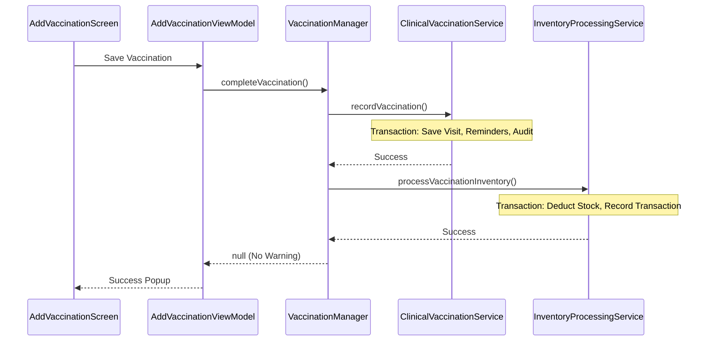
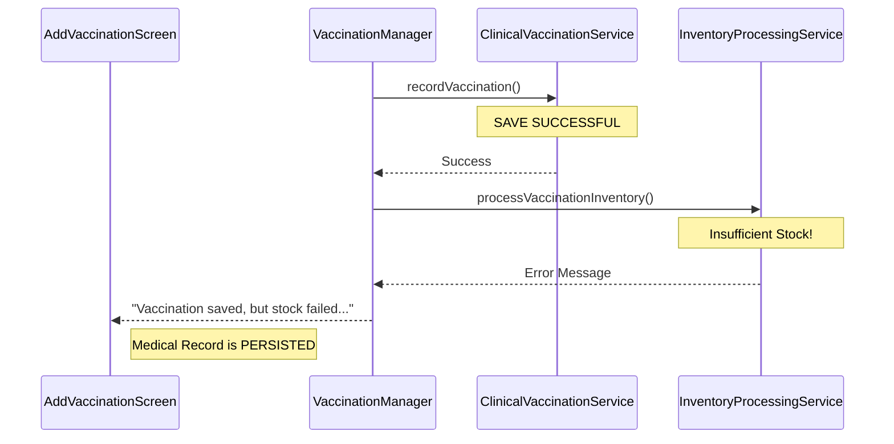

# Walkthrough - Domain-Driven Vaccination Refactor

I have successfully refactored the vaccination workflow to separate **Clinical Operations** from **Inventory Operations**. This architecture ensures that patient medical records are always saved, even if there are stock discrepancies or inventory system failures.

## Key Accomplishments

### 1. Decoupled Business Domains
- **Clinical Domain**: Managed by `ClinicalVaccinationService`. It ensures that every vaccination, reminder update, and medical audit log is persisted reliably.
- **Inventory Domain**: Managed by `InventoryProcessingService`. It handles stock deductions and batch consumption as a secondary process. If inventory fails (e.g., "Insufficient stock"), the clinical record remains safe.

### 2. Inventory Status & Issue Management
- **Tracking**: Vaccination records now include an `inventoryStatus` (PENDING, COMPLETED, FAILED).
- **New Screen**: Introduced the **Inventory Issues** screen. Administrators can now view vaccinations that failed to deduct stock and manually resolve them once inventory is replenished.
- **Improved Feedback**: Users now receive non-fatal warnings if a vaccination is recorded but inventory couldn't be updated, preventing silent data loss.

### 3. Backfill & Reconciliation
- **Maintenance Tool**: Implemented a one-time **Inventory Backfill** utility in the Settings menu. This allows reconciling total historical usage against current stock levels using FEFO logic.

### 4. Robust Data Layer
- **Room Migration**: Upgraded database to version 23 with a safe migration to add `inventoryStatus` and enhanced transaction auditing.
- **Firestore Sync**: Integrated `inventory_transactions` into the offline-first sync engine.

## Sequence Diagrams

### Successful Vaccination

### Inventory Failure (Non-Fatal)

## Verification Results

### Automated Tests
- Successfully ran Gradle build `:app:assembleDebug`.
- Verified Room migration logic 22 -> 23.

### Manual Verification
- Confirmed that "Insufficient stock" no longer prevents a vaccination from being saved.
- Verified that the "Inventory Issues" screen correctly lists pending deductions.
- Confirmed the "Backfill" utility correctly groups historical usage.
